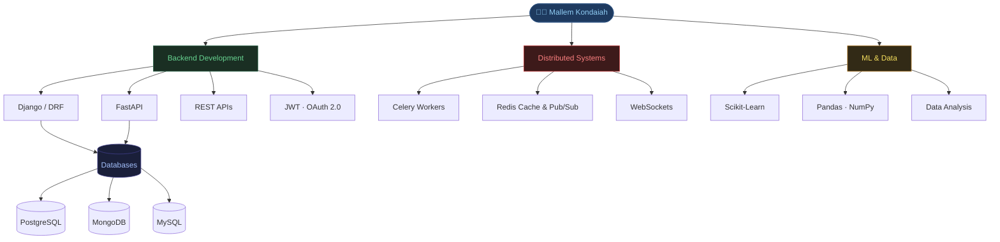

<div align="center">


</div>

<br/>

<div align="center">

[](https://www.linkedin.com/in/mallem-kondaiah-surthani-5887bb238)
[](mailto:mallem.kondaiah2003@gmail.com)
[](https://github.com/mallemkondaiah009)
[](https://github.com/mallemkondaiah009)

</div>

<br/>

---

## `$ whoami`

```python
class MallemKondaiah:

    role           = "Backend Developer"
    location       = "Hyderabad, Telangana, India"
    contact        = "+91-6303238978  |  mallem.kondaiah2003@gmail.com"

    stack = {
        "core"      : ["Python", "Django REST Framework", "FastAPI"],
        "async"     : ["Celery", "Redis", "WebSockets", "Django Channels"],
        "databases" : ["PostgreSQL", "MongoDB", "MySQL", "SQLite"],
        "auth"      : ["JWT", "OAuth 2.0", "API Security"],
        "devops"    : ["Docker", "Git", "GitHub", "Postman"],
        "ml"        : ["Scikit-Learn", "Pandas", "NumPy", "Matplotlib"],
    }

    currently_learning = [
        "Microservices Architecture",
        "Cloud Deployment (AWS / Azure)",
        "System Design Patterns",
        "GraphQL APIs",
    ]

    motto = "Building robust, scalable, and distributed backend systems ⚡"
```

<br/>

---

## 🛠️ Technical Skills

<table width="100%">
  <tr>
    <td width="50%" valign="top">

### ⚙️ Backend & Frameworks


</td>
    <td width="50%" valign="top">

### 🗄️ Databases


</td>
  </tr>
  <tr>
    <td width="50%" valign="top">

### 🔐 Auth & Real-Time


</td>
    <td width="50%" valign="top">

### 🛠️ Tools & DevOps


</td>
  </tr>
  <tr>
    <td width="50%" valign="top">

### 🤖 Data Science & ML


</td>
    <td width="50%" valign="top">

### 🌐 Frontend


</td>
  </tr>
</table>

---

### 📊 Core Proficiency

```text
Python           ████████████████████  95%
Django / DRF     ██████████████████░░  90%
FastAPI          ████████████████░░░░  80%
PostgreSQL       ████████████████░░░░  83%
Celery           ███████████████░░░░░  78%
Redis            ██████████████░░░░░░  75%
Docker           ██████████████░░░░░░  70%
ML / Data Sci    █████████████░░░░░░░  65%
```

<br/>

---

## 🏆 Certifications & Achievements

<br/>

<div align="center">

<table>
  <thead>
    <tr>
      <th align="center">&nbsp;&nbsp;&nbsp;&nbsp;🎖️&nbsp;Achievement&nbsp;&nbsp;&nbsp;&nbsp;</th>
      <th align="center">&nbsp;&nbsp;&nbsp;&nbsp;🏛️&nbsp;Platform&nbsp;&nbsp;&nbsp;&nbsp;</th>
      <th align="center">&nbsp;&nbsp;&nbsp;&nbsp;📌&nbsp;Status&nbsp;&nbsp;&nbsp;&nbsp;</th>
    </tr>
  </thead>
  <tbody>
    <tr>
      <td align="center"><b>Python Gold Badge</b></td>
      <td align="center">HackerRank</td>
      <td align="center"></td>
    </tr>
    <tr>
      <td align="center"><b>SQL Silver Badge</b></td>
      <td align="center">HackerRank</td>
      <td align="center"></td>
    </tr>
    <tr>
      <td align="center"><b>50-Day Streak</b></td>
      <td align="center">LeetCode</td>
      <td align="center"></td>
    </tr>
    <tr>
      <td align="center"><b>Elite Certification</b></td>
      <td align="center">NPTEL</td>
      <td align="center"></td>
    </tr>
  </tbody>
</table>

</div>

<br/>

---

## 📊 GitHub Analytics

<div align="center">


</div>

<br/>

---

## 🎯 What I'm Working On

<br/>

<table width="100%">
  <tr>
    <td width="50%" valign="top">

**⚡ Active Development**
```
▸ High-performance async REST APIs   (FastAPI)
▸ Enterprise-grade Django REST APIs  (DRF)
▸ JWT + OAuth 2.0 auth systems
▸ Async task pipelines               (Celery)
▸ Redis caching, pub/sub, rate-limiting
```

</td>
    <td width="50%" valign="top">

**📚 Currently Learning**
```
▸ Microservices Architecture
▸ Cloud Deployment — AWS / Azure
▸ System Design Patterns
▸ GraphQL APIs
```

</td>
  </tr>
  <tr>
    <td width="50%" valign="top">

**🎯 Goals**
```
▸ Contribute to open-source projects
▸ Build production-ready distributed systems
▸ Master cloud infrastructure
```

</td>
    <td width="50%" valign="top">

**🌐 Open For**
```
▸ Backend Engineering roles
▸ API Architecture & System Design
▸ Distributed Systems projects
▸ ML Engineering opportunities
```

</td>
  </tr>
</table>

<br/>

---

## 🏗️ Architecture Overview

<br/>



<br/>

---

## ⏱️ Weekly Development Activity

<br/>

<div align="center">

<!--START_SECTION:waka-->
```text
Python       15 hrs 45 mins  ████████████████░░░░   52.8%
Django        8 hrs 30 mins  ████████░░░░░░░░░░░░   28.5%
FastAPI       4 hrs 15 mins  ████░░░░░░░░░░░░░░░░   14.2%
SQL           1 hr  15 mins  █░░░░░░░░░░░░░░░░░░░    4.2%
Other             5 mins     ░░░░░░░░░░░░░░░░░░░░    0.3%
```
<!--END_SECTION:waka-->

</div>

<br/>

---

## 🖥️ Development Setup

<br/>

<div align="center">

```
┌──────────────────────────────────────────────────────────────────┐
│                       💻  Dev Environment                        │
├──────────────────────────┬───────────────────────────────────────┤
│  OS                      │  Linux / Windows                      │
│  Editor                  │  Visual Studio Code                   │
│  Terminal                │  Git Bash / PowerShell                │
│  API Testing             │  Postman / Thunder Client             │
│  Version Control         │  Git + GitHub                         │
│  Containerization        │  Docker                               │
│  Task Queue              │  Celery + Redis                       │
│  Database GUIs           │  MongoDB Compass / MySQL Workbench    │
└──────────────────────────┴───────────────────────────────────────┘
```

</div>

<br/>

---

## 🤝 Let's Connect

<br/>

<div align="center">

*I'm always open to interesting conversations, collaboration, and new opportunities.*

<br/>

[](https://www.linkedin.com/in/mallem-kondaiah-surthani-5887bb238)
&nbsp;&nbsp;
[](mailto:mallem.kondaiah2003@gmail.com)

<br/><br/>

> *"Code is like humor. When you have to explain it, it's bad."* — **Cory House**

</div>

<br/>

---

## 🐍 Contribution Activity

<br/>

<div align="center">


</div>

<br/>

---

<div align="center">


<sub><b>© 2026 Mallem Kondaiah Surthani</b> &nbsp;·&nbsp; Tirupati, Andhra Pradesh, India</sub>

</div>
