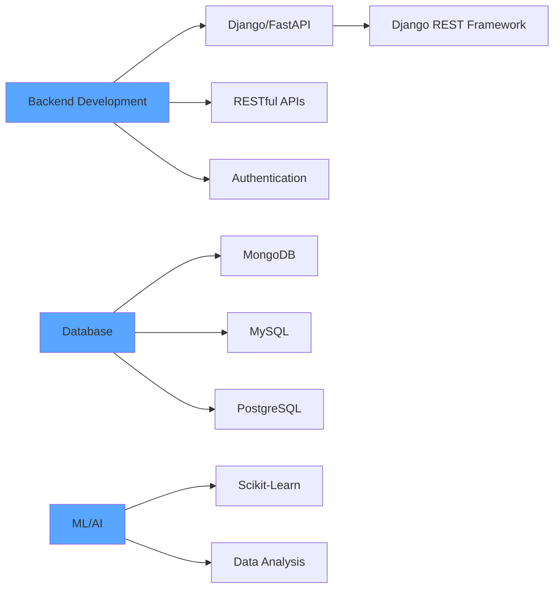

<div align="center">


</div>

---

<div align="center">

### 🌐 Connect With Me

<a href="https://www.linkedin.com/in/mallem-kondaiah-surthani-5887bb238">
  
</a>
<a href="mailto:mallem.kondaiah2003@gmail.com">
  
</a>


**📍 Location:** Tirupati, Andhra Pradesh, India | **📱 Phone:** +91-6303238978

</div>

---

## 👨‍💻 Professional Summary

```javascript
const mallemKondaiah = {
    role: "Backend Developer",
    location: "Tirupati, Andhra Pradesh, India",
    specialization: ["API Development", "Authentication Systems", "Real-Time Applications"],
    currentFocus: ["Scalable APIs", "Microservices", "ML Integration"],
    
    expertise: {
        backend: ["Django REST Framework", "FastAPI", "Express.js"],
        authentication: ["JWT", "OAuth", "API Security"],
        databases: ["MongoDB", "MySQL", "PostgreSQL", "SQLite"],
        ml: ["Scikit-Learn", "Pandas", "NumPy"],
        realTime: ["WebSockets", "Socket.IO"]
    },
    
    motto: "Building robust, scalable backend systems ⚡"
};
```

---

## 🛠️ Technical Skills

### **Backend Frameworks & Languages**
<p align="left">
  
</p>

### **Databases**
<p align="left">
  
</p>

### **Tools & Technologies**
<p align="left">
  
</p>

### **Data Science & Machine Learning**
<p align="left">
  
  
  
  
</p>

### **Frontend Technologies**
<p align="left">
  
</p>

---

## 🏆 Certifications & Achievements

<div align="center">

| Achievement | Platform | Status |
|:------------|:---------|:-------|
| **Python Gold Badge** | HackerRank | ✅ Earned |
| **SQL Silver Badge** | HackerRank | ✅ Earned |
| **50 Day Streak** | LeetCode | 🔥 Completed |
| **Elite Certification** | NPTEL | 🎓 Awarded |

</div>

---

## 📊 GitHub Analytics

<div align="center">


</div>

---

## 🎯 Current Focus Areas

```python
# Active Projects & Learning
current_work = {
    "api_development": {
        "fastapi": "Building high-performance async REST APIs",
        "django_drf": "Developing enterprise-grade Django REST APIs",
        "authentication": "Implementing JWT and OAuth authentication"
    },
    "learning": [
        "Microservices Architecture",
        "Cloud Deployment (AWS/Azure)",
        "System Design Patterns",
        "GraphQL APIs"
    ],
    "goals": [
        "Contributing to open-source projects",
        "Building production-ready scalable systems",
        "Mastering cloud infrastructure"
    ]
}
```

---

## 🧠 Technical Architecture

<div align="center">



</div>

---

## 💼 Professional Interests

<div align="center">

**Open for Opportunities In:**

`Backend Engineering` • `API Architecture` • `System Design` • `ML Engineering` • `Full-Stack Development`

</div>

---

## 📈 Development Activity

<div align="center">

<!--START_SECTION:waka-->
```text
Python       15 hrs 45 mins  ████████████████░   52.8%
Django        8 hrs 30 mins  ████████░░░░░░░░░   28.5%
FastAPI       4 hrs 15 mins  ████░░░░░░░░░░░░░   14.2%
SQL           1 hr 15 mins   █░░░░░░░░░░░░░░░░    4.2%
Other            5 mins      ░░░░░░░░░░░░░░░░░    0.3%
```
<!--END_SECTION:waka-->

</div>

---

## 🛠️ Development Environment

<div align="center">

```ascii
╔═══════════════════════════════════════════════════════════╗
║                  💻 Development Setup                     ║
╠═══════════════════════════════════════════════════════════╣
║  Operating System    : Linux / Windows                    ║
║  Code Editor         : Visual Studio Code                 ║
║  Terminal            : Git Bash / PowerShell              ║
║  API Testing         : Postman / Thunder Client           ║
║  Version Control     : Git + GitHub                       ║
║  Containerization    : Docker                             ║
║  Database Tools      : MongoDB Compass / MySQL Workbench  ║
╚═══════════════════════════════════════════════════════════╝
```

</div>

---

## 🎨 Dynamic Content

<div align="center">

### 💭 Random Dev Quote


</div>

---

<div align="center">

### 💡 Philosophy

*"Code is like humor. When you have to explain it, it's bad."* – **Cory House**

### ⭐ Support My Work

If you find my projects helpful, consider giving them a star!

</div>

---

## 🐍 Contribution Activity

<div align="center">


</div>

---

<div align="center">


**© 2026 Mallem Kondaiah Surthani. Building the future, one API at a time.**

</div>
